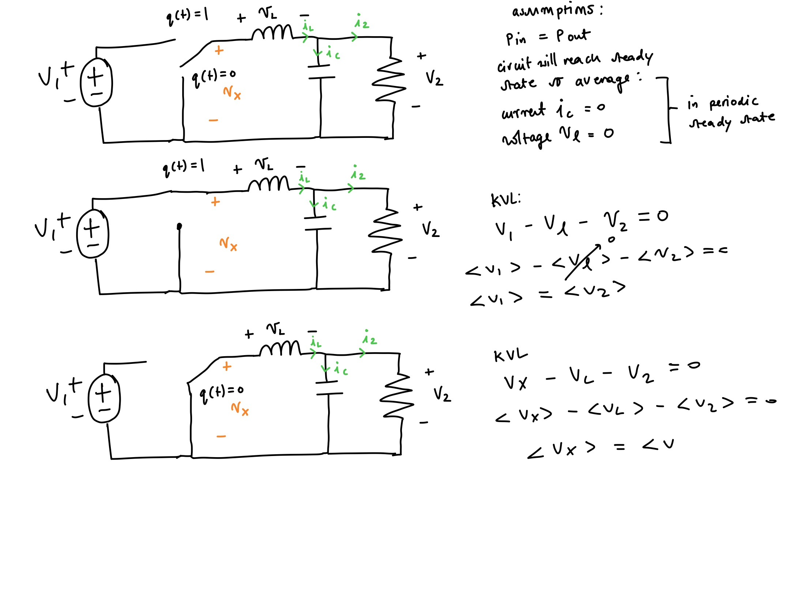

# Design-and-implementation-of-Buck-converter

# Project outlines 

This power converter will be used for a made up system which will take a 12V unregulated supply and step down to 3.3V for sensors and microcontrollers 

Input Voltage = 12V
Input Voltage = 3.3V

Full Load Iout,Max = 2.0A
 Min Load Iout,Min = 0.2A
 
 Frequency switching = 250kHz
 
 ΔVout ≤ 1% of Vout (33mV) peak-peak
 
 inductor ripple r = 30% - 40% of Iout,Max at steady Vin
 
 
 
 
  # Theory - What am i expecting the circuit to do explanation of the different states (IDEAL)
  
  

  

  
  
  
  becuase the assumprion is that the circuit is operating in periodic steady state (pss):
  
   - ic = C dvc/dt ----> dvc/dt = 0 becuase the current through capacitor isn't changing in pss so, i can assume that = 0 therefore, no current flows 
   
   - vl = l dil/dt ----> dil/dt = 0 becuase the voltage across the inductor isnt changing in pss so, i can assume that its = 0 therefore, no voltage drop across inductor
   
   -  There is no loss therefore the power going in = power going out Pin = Pout
  
  
 
