# IntroPowerElectronics---Design-and-implementation-of-Boost-Buck-converter
Introduction of basic mathematical theory and analysis techniques for power electronics to design and implement any converter. serves as a layer of knowledge before my 3rd yr as a EEE undergrad.

## The basic concept

Power coverters convert power from one form to another form at high efficientcy.

That could mean converting power from a power plant for it to be used in households or in industry. the power is converted based on what the load requires that could mean that the power needs to be in AC (alternating current) to spin motors & to be efficiently transmitted or to DC (Direct current) for batteries chargers etc...

INPUT FILTER -----> POWER STAGE ---->OUTPUT FILTER

  

Filters help reduce the noise, the noise comes from high frequency switching from capacitors ( voltage ripple ) and inductors ( current ripple ).

What makes power converters better?

- minituisation
- high efficientcy 
- better system bandwidth ( bandwidth is the measure which reacts to unexpected changes like current surges time to react to a sudden change is proportionate to bandwidth in your control loop )

## Linear Power Supply 

Why are power converters needed? can i just use a potential divider to get the output voltage i need?   

  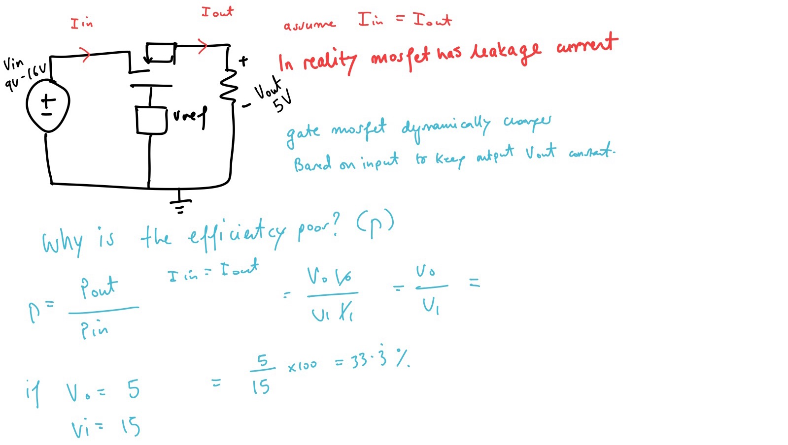

from the diagram above, this type of set up is used with power transistors in IC circuits for low power application there could be some filtering but it isn't essential. 

Typical Application which CAN'T be used here: microcontrollers becuase of high clock cycles

Typical Application which CAN be used: brushed DC motors, heating elements

 ## Typical power supply model
 

  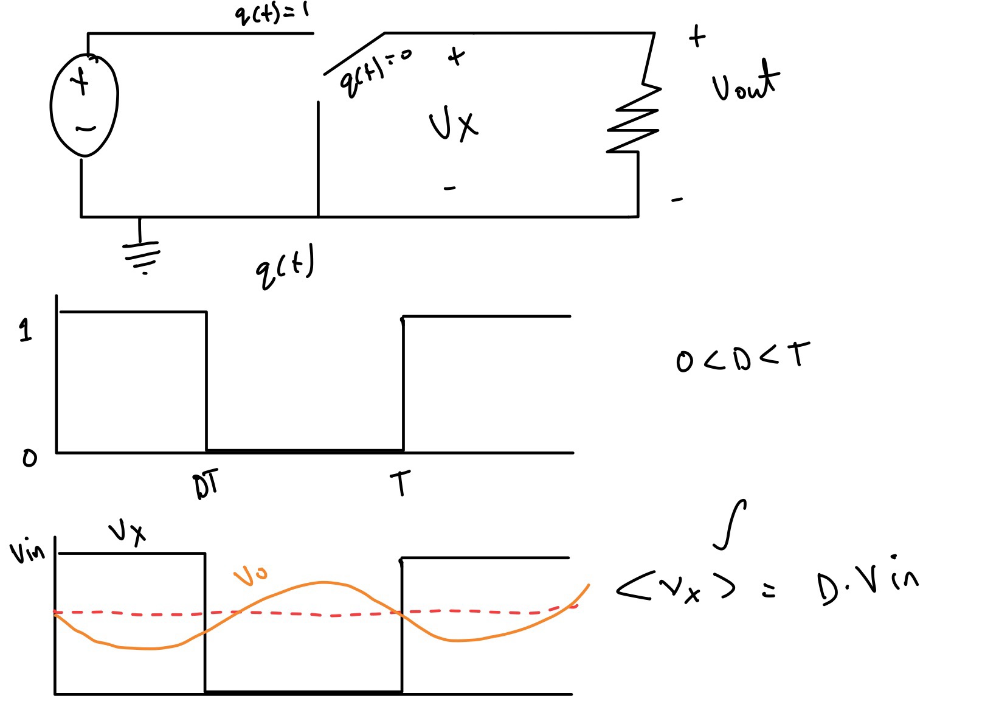

if i had a heating element at the load and i needed to control the average voltage ( Vx_Average ) i can just use the switch to pulsate between Vin & 0V. if the load was going to be a microprocessor then this would cause the load to break. This is called PWM moduation where i control the average voltage by controlling the fraction of the time that the switch is on compared to when the switch is off.

  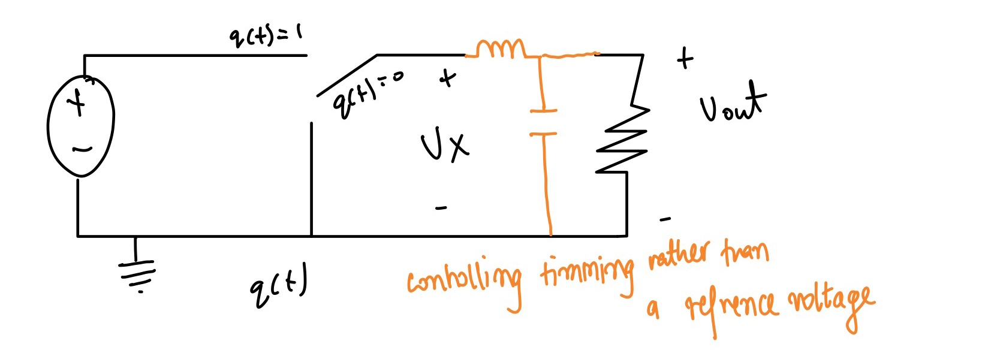

This type of adjustment will turn this pulsating voltage from a pwm to a v out which just has the DC component using A low pass filter (LPF) to attenuate the AC component (there is a ripple which is introduced but can be improved with a better cut of freqiency of the LPF).

 # Tools to Analyse Circuits
 
 ## Method of Assumed States (MAS) Time Domain Analysis
 
 Circuit switching will be done by semicoductor devices, they can be controlled or external circuit events will dictate whetehr my circuit will turn on and off at a certain time. 
 
 
 Circuit below, demonstates a sinusodial signal where it has a diode which acts like a switch ideal characteristic to simplify analysis usually diodes have exponential characteristics.
 
  

  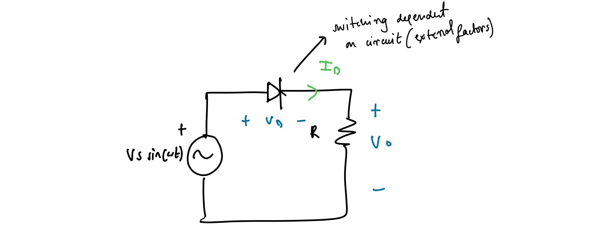

 
 ideal diode characteristic this below, if my switch is:
 
 - ON  :  closed circuit my diode must have No potential difference across it, any current can flow 
 - OFF :  open circuit my diode must have any -ve potential difference across it, no current flows
 
 Diode is an uncontrolled switched what controls its switching? WHAT CAN THE DIODE NOT DO?
 
 - diode can't have a positive potential difference because it will turn on
 
 - diode can't have a negative current becuase it will turn off
 
   

  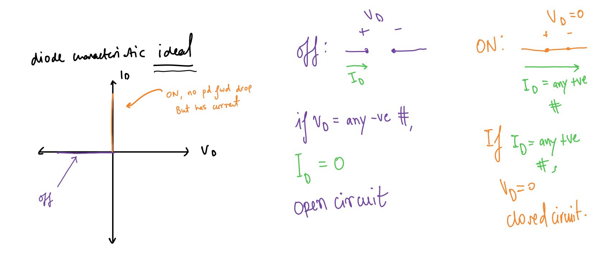

 
 
  ## MAS
 
 - assume a state for each switch, guess
 
 - replace open circuit if off and closed circuit if its on
 
 - analyse the V's & I's in the circuit (this is just  alinear circuit problem with caps and inductors no exponentials)
 
 - check if swith conditions are violated
 
 - if not keep going in time , if violated make a new set of conditions and do it over again
 
 below is a diagram visuallz describing what is happening
 
    

  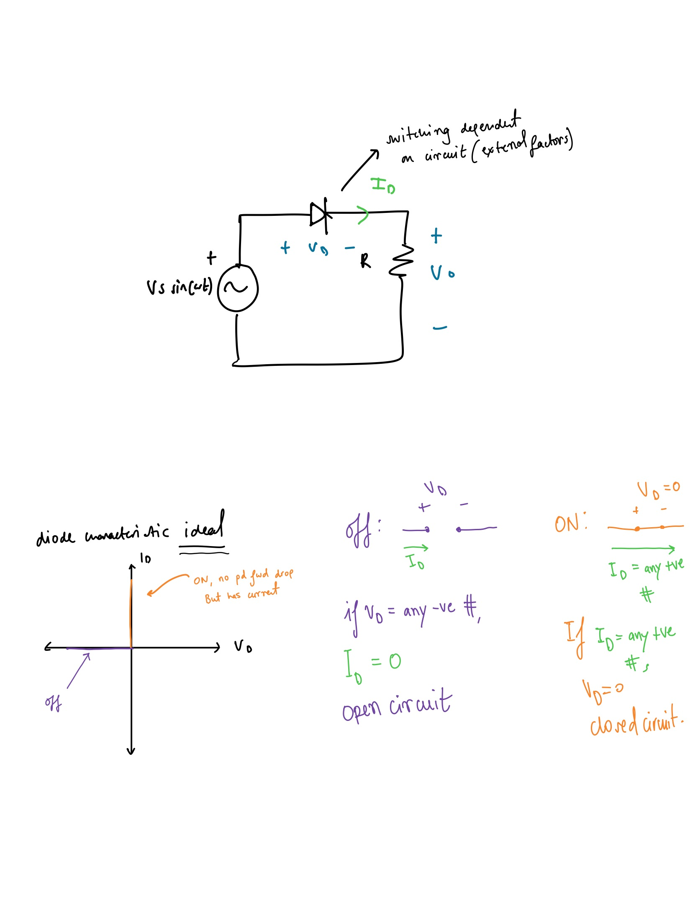

 
  ## example of MAS
 
     

  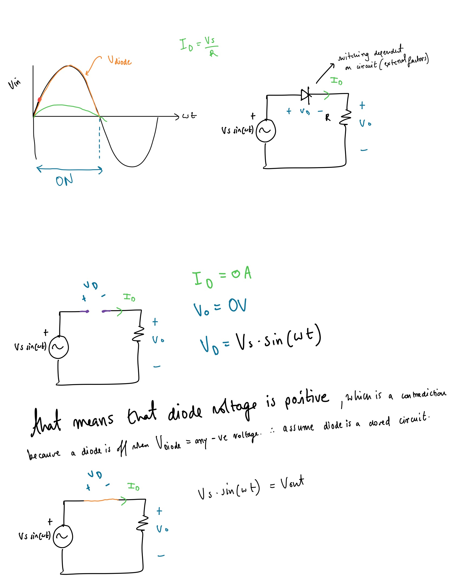

 
 What is the circuit doing at t = positive number ?
 
 1. assume the diode is off
 
 2. replace diode with open circuit 
 
 3. evaluate the currents and voltages, Idiode = 0A open circuit, Vout = 0 open circuit Vdiode = Vssin(wt), this mean that the diode voltage is positive for when the diode is off which is a contradiction therefore for this simple circuit the diode is on.
 
    

  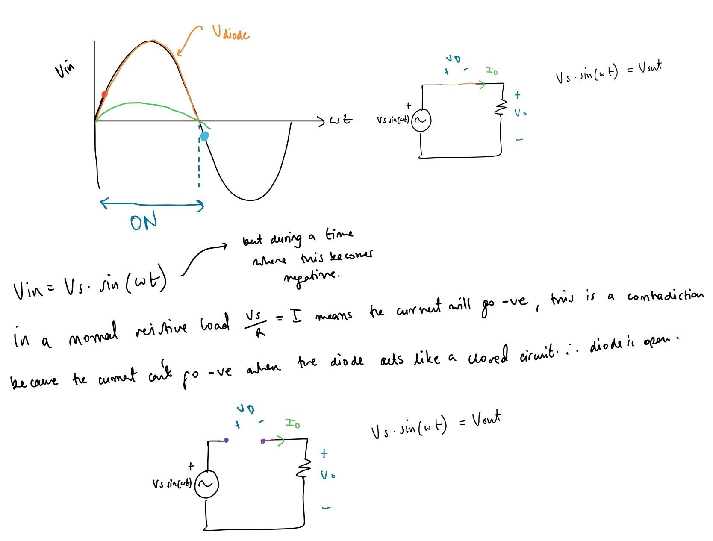 

 
 when the circuit crosses the point where the Vin becomes neagtive where the blue dot is if i continue to assume that this is a closed circuit what happens?
 
 1. assume that the diode is still on
 
 2. diode is replaved with a closed circuit 
 
 3. analyse the currents and voltages Vdiode = whatever the supply is at the time which is negative. Idiode = Vin/R this will become a negative number, this is a contradiction becuase the current cant go negative when the diode acts like a closed circuit so the diode must be open here.
 
 this means Vdiode and Idiode = 0 so the wavefrom just goes to 0 when the diode is off.
 
 
  ## Periodic Steay State (PSS)
 
 Usually power converters operate cyclicly, this is when all the waveforms look the same after many cycles. Based on this, i can make assumptions on how my capacitors and inductors behave and simpligy my analysis.
 
      

  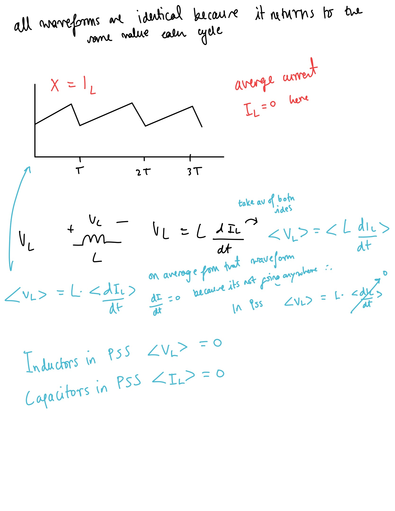

 
 
 ## PSS Example with a poor assumption
 
 
       

  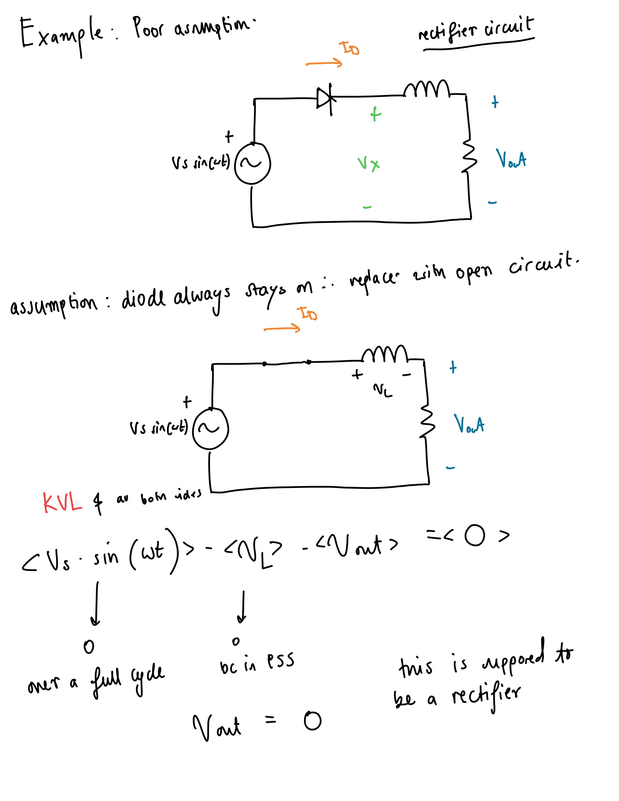

  
 i this example the current in the circuit gets smoothed out, but the assumption i made whilst analysing the circuit was bad becuase the diode is on all the time. 
 
 why is it bad? well the indutor does nothing becuase it just a short circuit but it did tell mw that i made a mistake by making an aggressive assumption... 
 The way the lecturer explaisn it if the average v out is negative and its assumed the inductor has some positive current going through it the current through the resistor must be negative some of the time hence the diode must have a negative current which isnt possible from our switch assumptions in the above tool that we discussed.
 
 
 
 faulty assumptions:
 
  - diode is always on, its not always on it turns off when the voltage across the diode hits 0 and then a bit after as the inductor discharges.
  
  - my circuit now doesnt act like a rectifier but as a AC RL circuit
  
  In a half wave rectifier with a resistive load the current stops as soon as the AC voltage crosses 0. During the positive cycle the inductor stores energy. when the voltage at the supply goes negative the inductor wants to force the diode to keep being forward biased so it reverses its own polarity. the volatge at the load becomes negative during becuase diode is still on whislts Vsupply is negative
 
 
 - an aside the extinction angle is the point where the diode turns off in a with just a resistor and an ac supply this is equal to pi = beta but when there is an inductor then beta is between 180 - 360 degrees.
 
        

  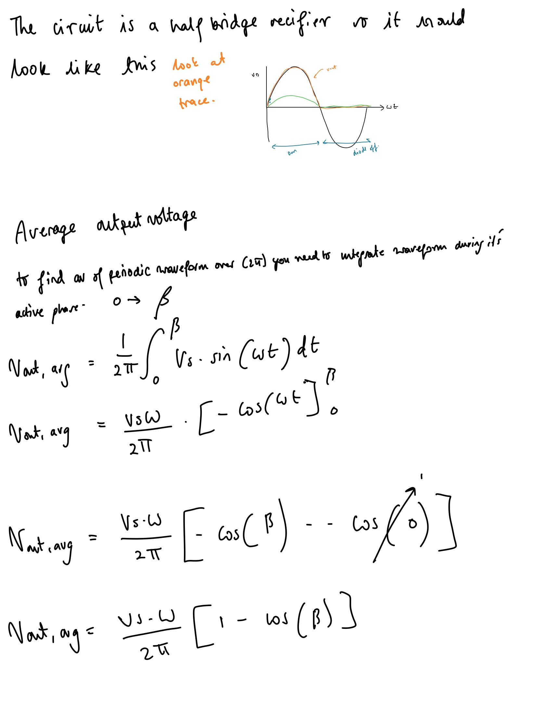

 
 
 
         

  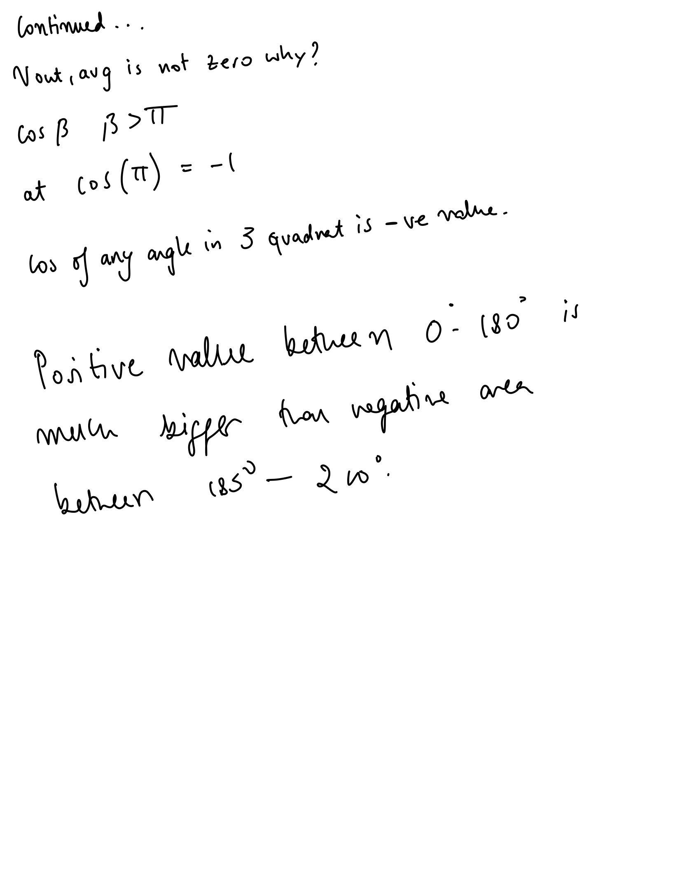

 
 
 
 ## Root Mean Squared of a signal (RMS)
 
 X(t) is some random signal with AC and DC components, im going to intergrate this X(t) which will give me the total energy of the signal but because the signal is sinusoidal i could be integrating a negative (-ve) and positive (+ve) which will give me Energy total = 0 which is wrong. this is where i get my rms value.
 
 

  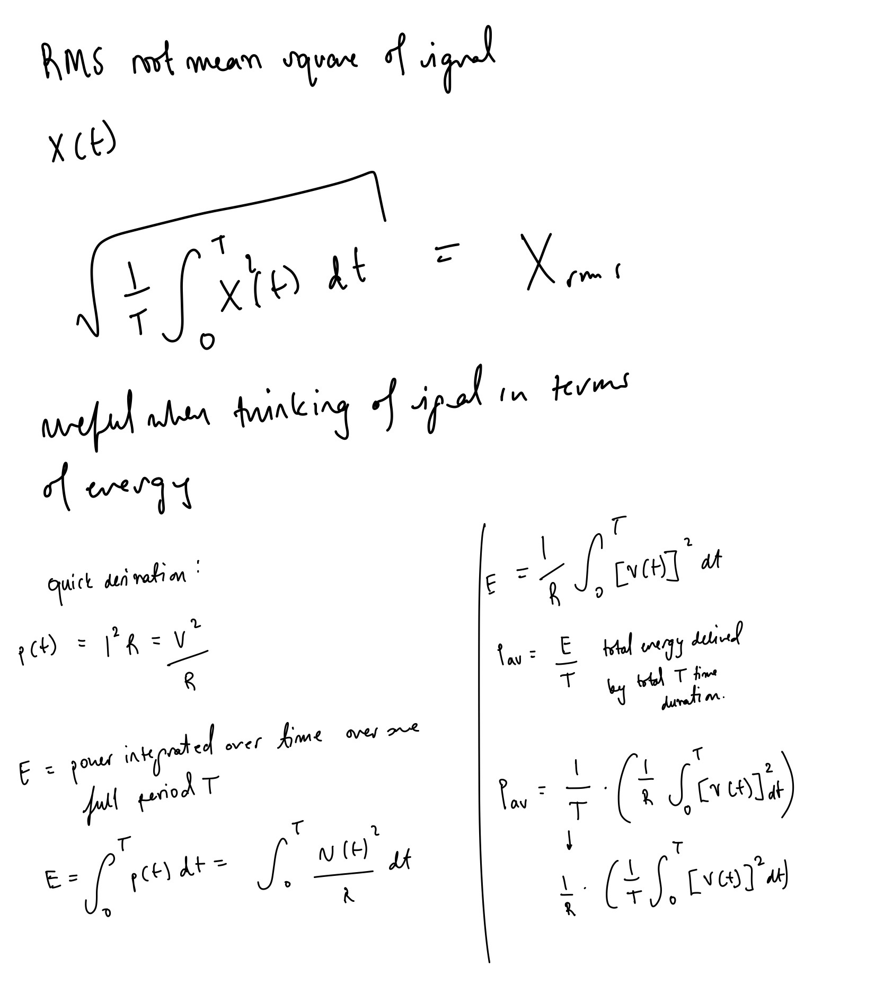

  

  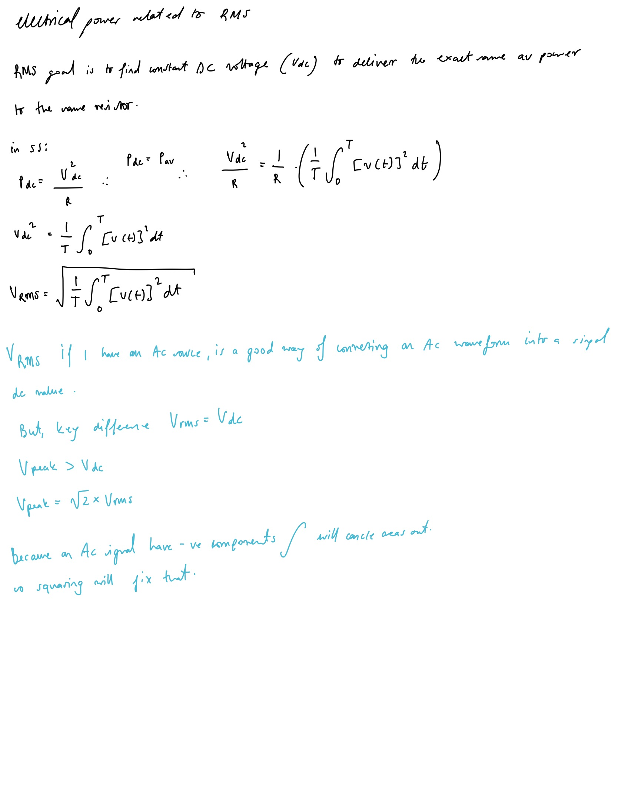

 
 
  ## Orthonogality for a continous waveform
  
  -  This is relating calculus which i have done in my 2nd yr modules about vectors. if two vectors are at 90 degrees out of phase then they equal 0 is they are the same magnitude. 
  
 - if i have a sin * cos of the same frequency then the integration is also =  0 
 
  - then the last one is a useful trig identity
  
  
  

  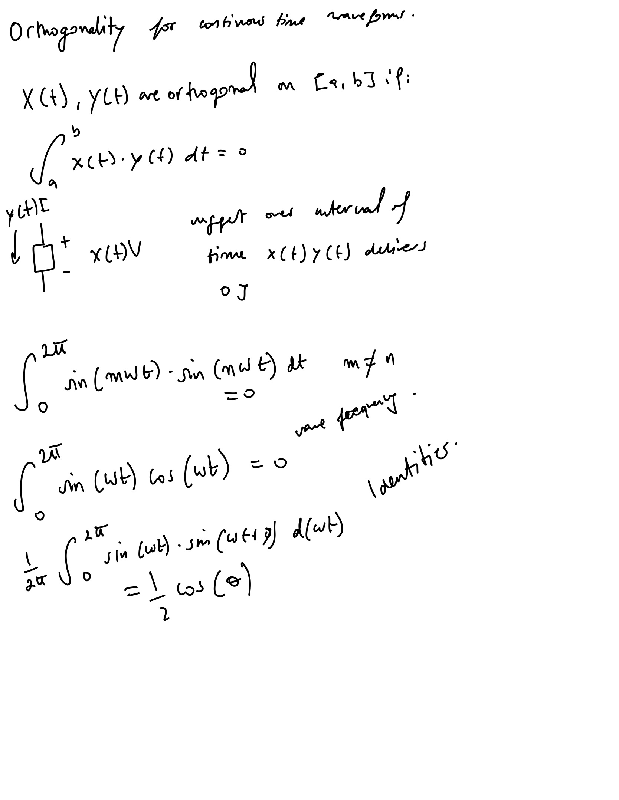

 ## Average power going thorugh an inductor
 
 this part will use a simple circuit and the defenition of RMS that i disscussed to find the average power going through an inductor
 
   

  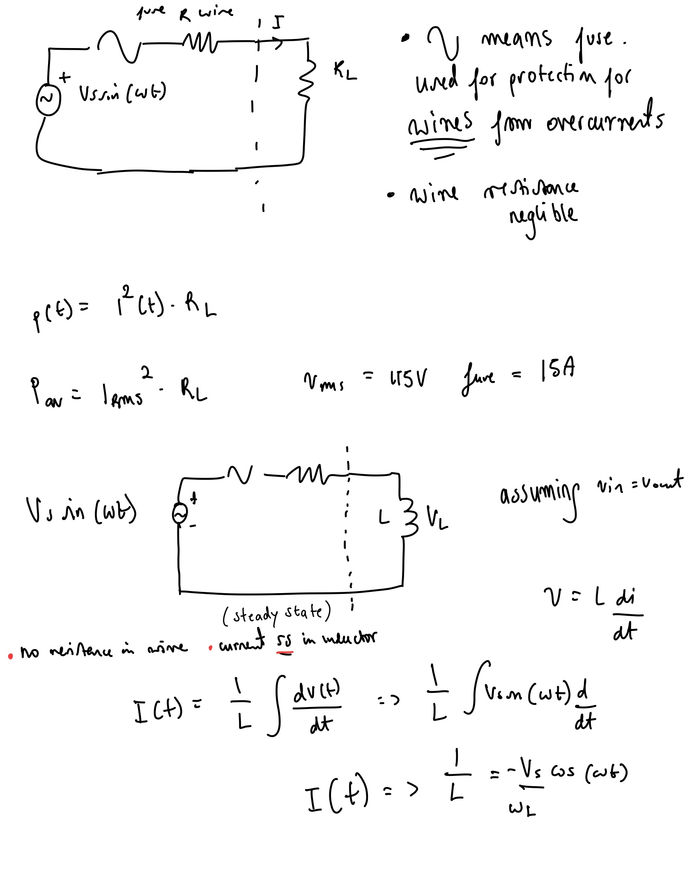

